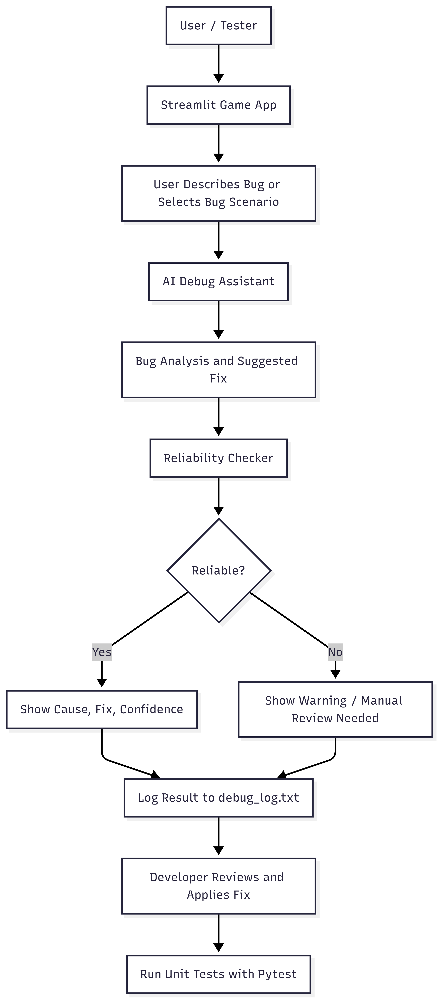
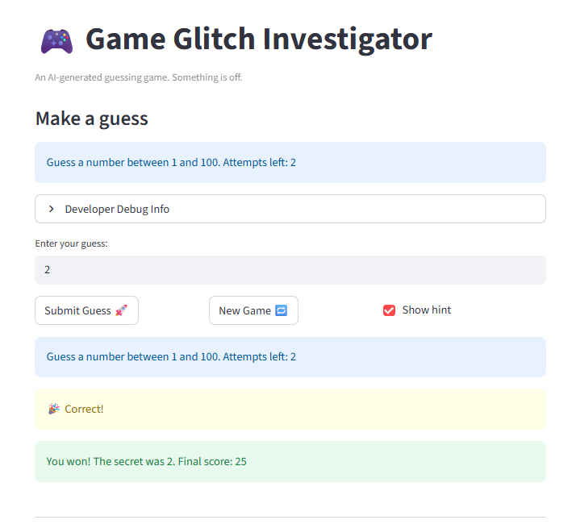
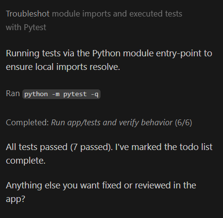
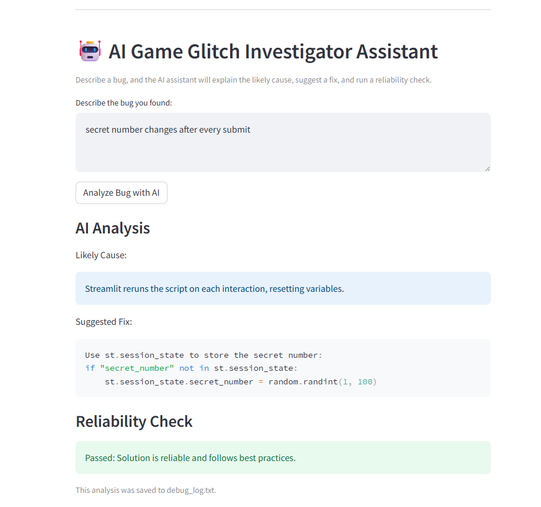

# 🎮🤖 AI Game Glitch Investigator Assistant

## 🚨 The Situation

You asked an AI to build a simple "Number Guessing Game" using Streamlit.  
It wrote the code, ran away, and initially left behind a buggy system.

This project not only fixes those issues but evolves the system into an **AI-powered debugging assistant**.

---

## 📌 Original Project (Module 1)

This project extends my original project: **"Game Glitch Investigator"**

The original system was a Streamlit-based number guessing game designed to demonstrate debugging and testing concepts. It included gameplay features like difficulty levels, scoring, and attempts tracking, but intentionally contained bugs in state management, input validation, and logic. The goal was to identify and fix these issues using structured debugging and testing.

---

## 🎯 Project Summary

This project transforms a buggy guessing game into an **Applied AI System** that:

- Detects and explains bugs
- Suggests fixes
- Evaluates reliability
- Logs system behavior

It demonstrates how AI can assist developers in debugging and validating systems.

---

## 🎮 Features

### Core Game
- Number guessing game with difficulty levels
- Attempts tracking and scoring
- Input validation

### AI Debug Assistant
- Accepts bug descriptions
- Explains root causes
- Suggests fixes
- Handles unknown inputs safely

### Reliability System
- Confidence scoring (High / Medium / Low)
- Detects "no bug" scenarios
- Prevents incorrect suggestions

### Logging
- Saves outputs in `debug_log.txt`
- Tracks bug → cause → fix → result

### Testing
- Unit tests using `pytest`

---

## 🏗️ System Architecture



### Architecture Explanation

The system follows a modular AI workflow:

User → Streamlit App → AI Debug Assistant → Reliability Checker → Output → Logger

- The user inputs a bug description
- The AI analyzes and suggests a fix
- The reliability system evaluates the confidence
- The result is displayed and logged

---

## ⚙️ Setup Instructions

```bash
pip install -r requirements.txt
streamlit run app.py
```

## 🧪 Sample Interactions

Example 1: Bug Detection
Input:

```bash
secret number changes after every submit
```

Output:

Cause: Streamlit reruns script on each interaction
Fix: Use st.session_state
Reliability: High

Example 2: Logic Issue
Input:

```bash
wrong hint is showing higher and lower incorrectly
```

Output:

Cause: Incorrect comparison logic
Fix: Correct if-else conditions
Reliability: High

Example 3: No Bug Scenario
Input:

```bash
my game is working fine
```

Output:

```bash
No issue detected. The game appears to be functioning correctly.
```

## 🧠 Design Decisions
Used a rule-based AI system instead of a full LLM to keep the system lightweight and deterministic
Added predefined bug scenarios to improve usability
Implemented confidence scoring to improve reliability
Designed modular components for easy extension
Trade-offs
Limited flexibility compared to real AI models
Requires predefined patterns for bug detection
Faster, more reliable, and easier to test

## 🧪 Testing Summary
All unit tests for game logic passed successfully
AI assistant correctly identified known bugs
Unknown inputs were handled safely with low or no-risk output
Confidence scoring improved clarity of responses

Summary:

```bash
5 out of 5 core scenarios passed successfully.
System safely handled unknown inputs without generating incorrect fixes.
```

##🔍 Reliability & Evaluation

The system includes:

Confidence scoring (High / Medium / Low)
Logging of all AI outputs
Safe fallback for unknown inputs
Human-readable explanations

This ensures the system is not only functional but trustworthy and explainable.

## 💡 Reflection

This project taught me:

How to integrate AI into real-world applications
The importance of guardrails in AI systems
How to design systems that explain decisions, not just produce results
The value of modular design and testing in building reliable software

It also reinforced that AI systems must be transparent, reliable, and safe, especially when assisting in debugging or decision-making tasks.

## 📂 Project Structure
```bash
app.py
logic_utils.py
ai_debug_assistant.py
reliability_checker.py
logger_utils.py
tests/
assets/
```

## 📸 Demo



### 🚀 Stretch Features



### New Feature: AI Assistant Demo



## 🚀 Future Improvements
Integrate real LLM (OpenAI / Gemini)
Auto-detect bugs from game behavior
Add RAG for dynamic bug retrieval
Improve UI and interactivity

## 🏁 Conclusion

This project demonstrates how a simple application can evolve into a responsible AI system that not only solves problems but explains and validates them.
